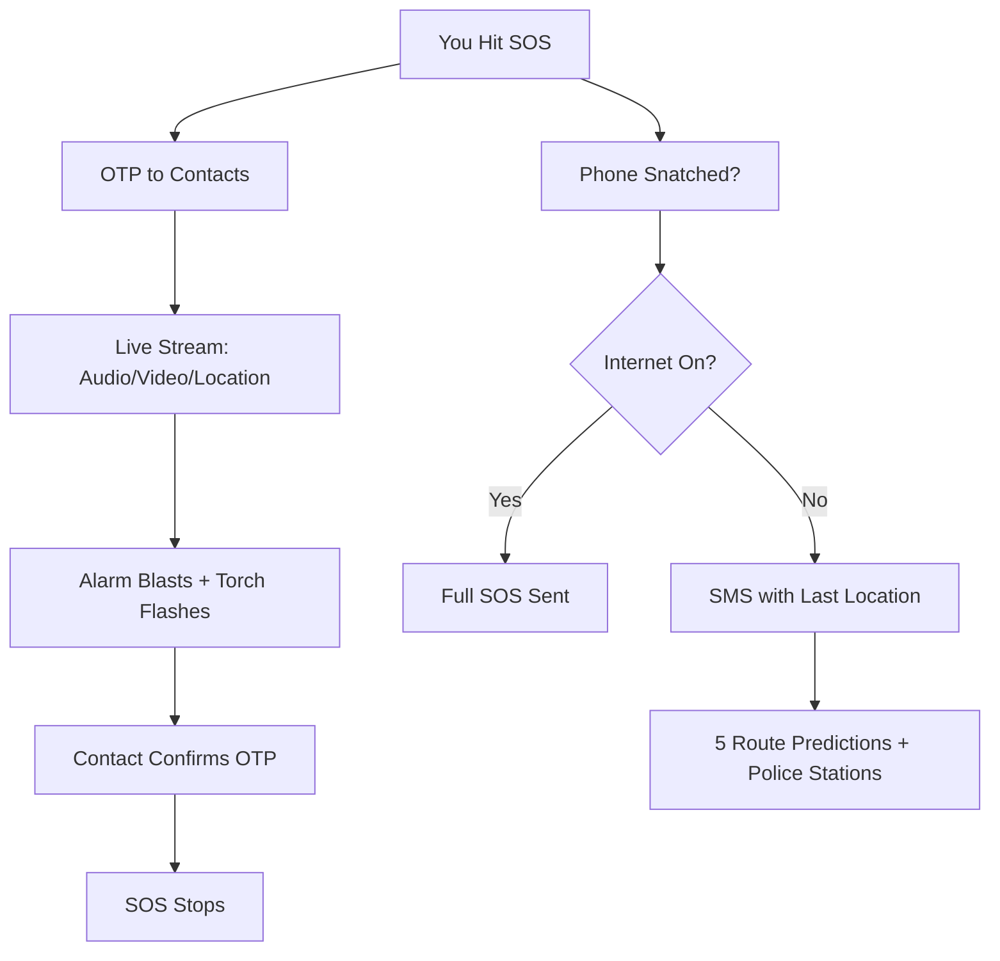
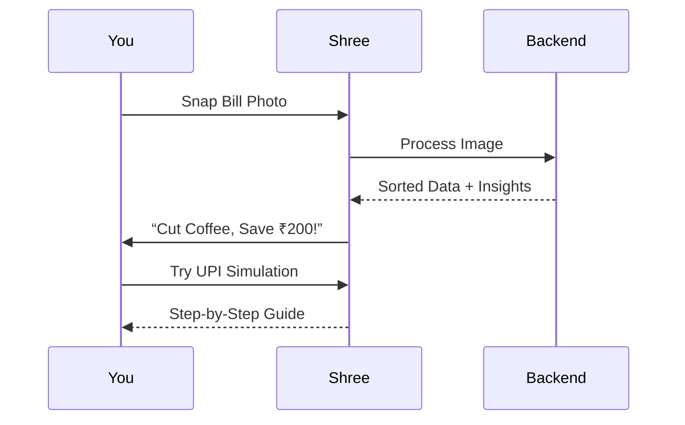
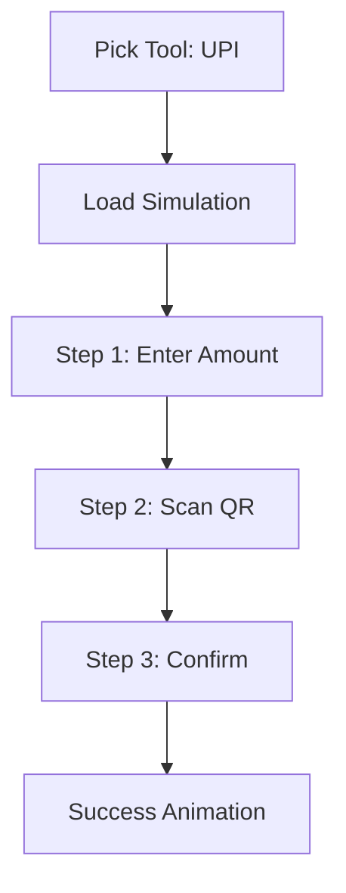
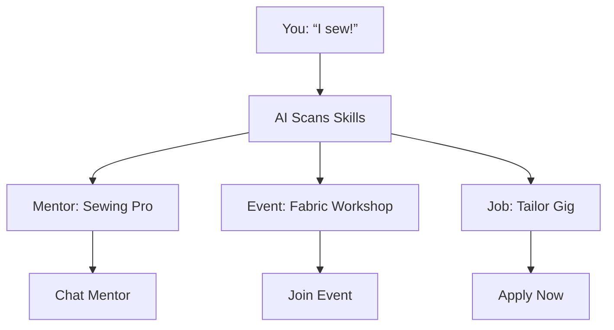
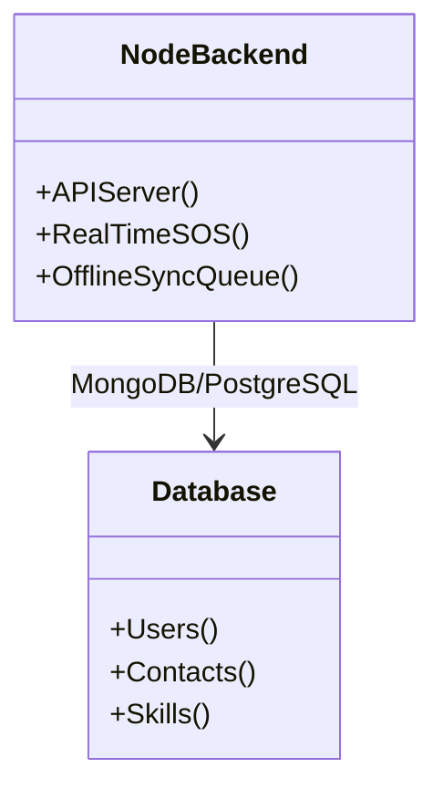
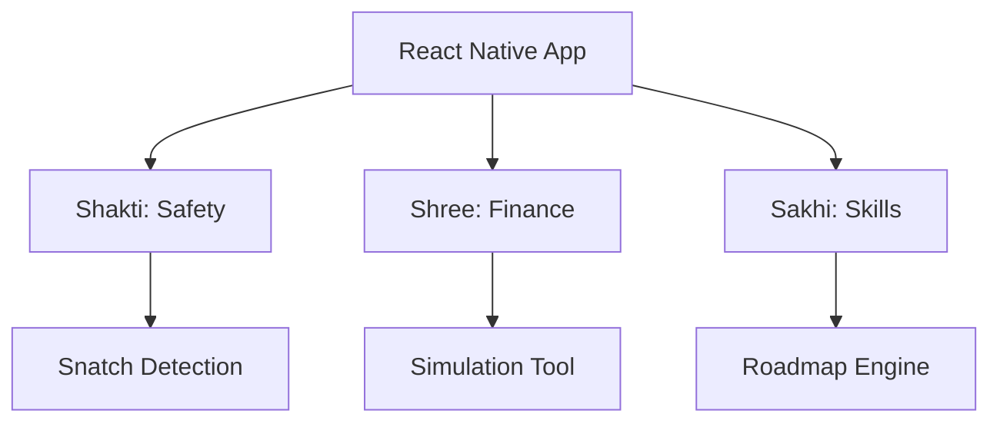
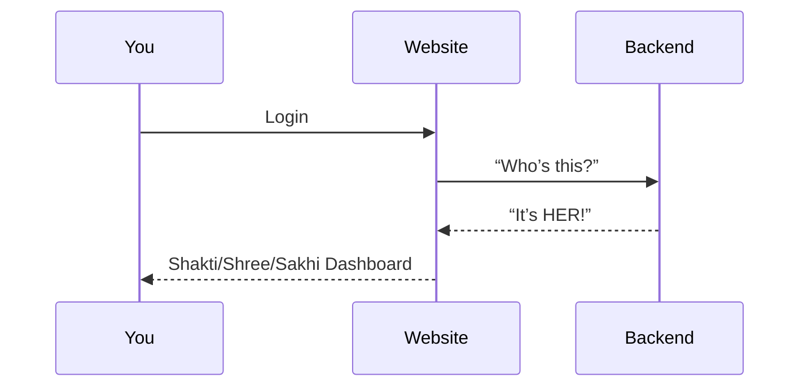
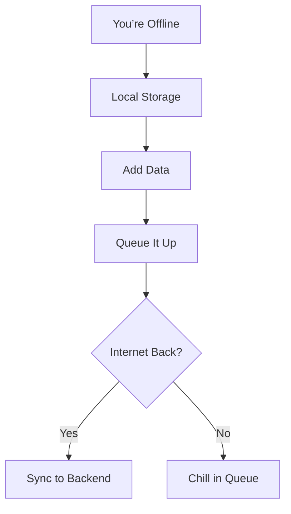

Demo Video Link: https://drive.google.com/drive/folders/1ey79pfndQnwfEFqc_zUPV_vP96XF0JHa
Youtube Video Link: https://youtu.be/xK2FY7QEu6A
---


# 🌟 Saheli: The Ultimate Women’s Empowerment Suite 🌟 


---

## Updated Table with 20 Features  

| **App**       | **Feature**                          | **Description**                                                                                   |
|---------------|--------------------------------------|---------------------------------------------------------------------------------------------------|
| **Shakti**    | Swift Location Sharing              | One-tap sharing of live location with unlimited emergency contacts from your phonebook.           |
| **Shakti**    | Fake Calling                        | Pre-set fake call with mock audio to deter intruders, triggered with a single tap.                |
| **Shakti**    | SOS System                          | One-click triggers OTP to contacts, shares audio/video/location, loud alarm + torch; ends with OTP confirmation. |
| **Shakti**    | Offline Storage                     | Stores all SOS recordings and videos locally on the device, accessible without internet.          |
| **Shakti**    | Snatch Detection                    | Detects phone jerks; sends SOS (if online) or SMS with last location (offline) + 5 route predictions for guardians. |
| **Shakti**    | Emergency Contacts Page             | One-tap calls to pre-loaded numbers like police, ambulance, and local support services.           |
| **Shakti**    | Chatbot                             | Offline-capable chatbot for real-time emotional support or advice.                                |
| **Shakti**    | Safety Score                        | Tracks usage (e.g., SOS triggers, location shares) and gives a safety preparedness score with tips. |
| **Shree**     | Personal Expense Tracker            | Tracks income and expenses manually with a simple UI, showing spending patterns.                 |
| **Shree**     | Doc Upload                          | Upload financial docs (e.g., receipts); AI extracts, organizes, and generates insights.           |
| **Shree**     | Personalized Recommendations        | Tailored cost-cutting tips based on your spending + curated YouTube videos for learning.          |
| **Shree**     | Simulation Tool                     | Offline interactive simulations for UPI, HDFC Netbanking, and ATM usage with step-by-step guides. |
| **Shree**     | Budget Goal Setter                  | Set savings goals (e.g., “₹5000 for a saree”); tracks progress and nudges you with alerts.        |
| **Shree**     | Expense Sharing                     | Split bills with friends or family via app-generated links—perfect for group outings.             |
| **Sakhi**     | Skills Matching                     | AI matches your skills (manual text input) to mentors, jobs, and events (e.g., tech, stitching).  |
| **Sakhi**     | Community Forum                     | Chat, share, and connect in a forum; works offline with cached threads.                           |
| **Sakhi**     | Roadmap Plan                        | Custom growth plan with quizzes, lessons, videos, and mentor connections—accessible offline.      |
| **Sakhi**     | Skill Badges                        | Earn digital badges for completing roadmap milestones (e.g., “Sewing Star”)—gamifies learning.    |
| **Learning Platform (Shared)** | Course Library                | Centralized hub of short courses (e.g., safety tips, budgeting basics, sewing 101)—offline-ready. |
| **Learning Platform (Shared)** | Progress Dashboard            | Tracks learning across all apps (Shakti safety lessons, Shree finance courses, Sakhi skills)—unified view. |

---

**Birthed in 24 Hours of Fierce Determination at the Hackathon by Team Init.io**  

- **Hey, Queens!** Ready to take charge of your safety, finances, and dreams? Meet *Shakti*, *Shree*, and *Sakhi*—three unstoppable SaaS queens built from the ground up to smash barriers and lift YOU up!  
- **Picture This**: A world where you’re safe with one tap (*Shakti*), ruling your money like a boss (*Shree*), and chasing your wildest ambitions with a personalized plan (*Sakhi*).  
- **Who Did This?** Team Init.io—four warriors (Vinayak Bhatia, Atharva Patil, Harshit Bhanushali, and Anushka Shendge)—crafted this magic in a 24-hour hackathon frenzy.  
- **Why It’s Epic**: Novel features, offline power, and a heart that beats for women’s strength—built for YOU, by people who get it.  
- **What’s Inside?** Three end-to-end apps, dripping with innovation, ready to change lives. Scroll down, sisters—this is YOUR empowerment toolkit!


---

## 🚀 PROJECT OVERVIEW: THE WOMEN’S POWER TRIFECTA  
- **Team Name**: Init.io (Because we’re starting a movement!)  
- **Dream Team**:  
  - Vinayak Bhatia - The tech wizard  
  - Atharva Patil - The code ninja  
  - Harshit Bhanushali - The design dynamo  
  - Anushka Shendge - The vision queen  
- **Where It Happened**: Odoo Gujarat Vidyapeeth Hackathon  
- **How Long**: 24 hours of non-stop brilliance (no sleep, just grit!)  
- **Tech Magic**:  
  - **Backend**: Node.js (fast, fierce, and flawless)  
  - **Mobile App**: React Native (works on every phone, everywhere)  
  - **Website**: React (sleek, stunning, and oh-so-accessible)  

- **The Big Three**:  
  - **Shakti**: Your safety superhero—keeping you fierce and fearless.  
  - **Shree**: Your money mentor—named after the Hindi word for prosperity, because you deserve wealth, girl!  
  - **Sakhi**: Your growth BFF—meaning "friend" in Hindi, here to cheer you on!  

- **Why It’s For YOU**: Every button, every feature, every line of code—crafted to tackle the real struggles women face. Let’s break it down!

---

## 🌼 SHAKTI: YOUR SAFETY QUEEN—FEARLESS AND FIERCE  
- **What’s Shakti?** A safety app so powerful, it’s like having a guardian angel in your pocket—built for women, by people who care.  
- **Mission**: Keep you safe, no matter where you are—day or night, online or off.  
- **Why It’s Different**: Packed with features no one else dares to dream of—offline-ready, real-time, and oh-so-smart!  

### 🌟 SHAKTI FEATURES: EVERY DETAIL YOU NEED TO KNOW  
- **1. Swift Location Sharing**  
  - **What’s This?** Share your exact spot with your crew in ONE tap.  
  - **How It Works**:  
    - Open Shakti (it’s lightning-fast, promise!).  
    - Pick your emergency contacts—Mom, bestie, whoever—from your phonebook. No limit, add them all!  
    - Hit “Share Location”—boom, they know where you are.  
  - **Why It’s Awesome**: No fumbling, no delays—just pure speed when you need it most.  
  - **For You**: Walking alone? Late-night commute? You’re covered, queen!  

- **2. Fake Calling Feature**  
  - **What’s This?** A sneaky call to throw off creeps—like your phone’s playing wingwoman!  
  - **How It Works**:  
    - Set up a fake caller during profile setup (e.g., “Dad” or “Boyfriend”—you choose!).  
    - Feeling uneasy? Tap “Fake Call.”  
    - Your phone rings with mock audio—like a real chat about dinner plans or “I’m almost home!”  
  - **Why It’s Awesome**: Subtle, smart, and a total game-changer—intruders back off fast.  
  - **For You**: Stuck in a sketchy spot? This is your escape trick!  

- **3. SOS System**  
  - **What’s This?** A full-on emergency blast—your safety net when things get real.  
  - **How It Works**:  
    - One click on “SOS” and here’s what happens:  
      - Sends an OTP to ALL your emergency contacts.  
      - Streams live audio, video, pics, and your location to them instantly.  
      - Blasts a LOUD alarm to scare off threats.  
      - Flashes your torch non-stop—light up the scene!  
    - Only stops when a contact enters the OTP—total control.  
  - **Why It’s Awesome**: It’s like shouting for help, but smarter and louder—no one ignores this!  
  - **For You**: In danger? Shakti’s got your back, loud and proud!  

- **4. Offline Storage**  
  - **What’s This?** Keep all your recordings safe, no internet needed.  
  - **How It Works**:  
    - Every SOS audio or video? Saved right on your phone.  
    - No cloud, no leaks—just your device, your rules.  
  - **Why It’s Awesome**: Evidence stays with you, even off-grid—privacy first!  
  - **For You**: Rural areas, no signal? You’re still protected, babe!  

- **5. Snatch Detection**  
  - **What’s This?** Your phone knows if someone grabs it—and fights back!  
  - **How It Works**:  
    - Detects a sudden jerk (like a snatch).  
    - Internet on? Full SOS blasts out.  
    - No internet? Sends an SMS with your last-known location to your crew.  
    - For your guardians: Predicts 5 possible routes you might’ve gone + nearby police stations.  
  - **Why It’s Awesome**: No one else does this—pure innovation!  
  - **For You**: Phone stolen? Shakti still saves the day!  

- **6. Emergency Contacts Page**  
  - **What’s This?** One-tap calls to the cavalry—police, ambulance, you name it!  
  - **How It Works**:  
    - Pre-loaded with key numbers—local police, medics, helplines.  
    - Just tap to dial—no searching, no stress.  
  - **Why It’s Awesome**: Speed dial for survival—every second counts!  
  - **For You**: Need help NOW? It’s right there, sister!  

- **7. Chatbot Buddy**  
  - **What’s This?** Your 24/7 confidante—chat when you need to.  
  - **How It Works**:  
    - Tap the chatbot anytime—feeling scared or just wanna talk?  
    - Works offline with pre-loaded responses—always there for you.  
  - **Why It’s Awesome**: Safety isn’t just physical—it’s emotional too!  
  - **For You**: Need a pep talk? Shakti’s got you, girl!
  - 


#### 🌸 Mermaid Diagram: Shakti SOS in Action  


---

## 💰 SHREE: YOUR MONEY, YOUR POWER  
- **What’s Shree?** A financial fairy godmother—named after “Shree” (prosperity in Hindi)—here to make you a money queen!  
- **Mission**: Break the financial literacy gap with tools so easy, you’ll wonder why you ever doubted yourself.  
- **Why It’s Different**: Offline simulations, tailored tips, and doc magic—no one does it like this!
  -


### 🌟 SHREE FEATURES: YOUR MONEY TOOLKIT  
- **1. Personal Expense Tracker**  
  - **What’s This?** Your spending diary—track every rupee like a pro!  
  - **How It Works**:  
    - Add income (salary, side hustle) and expenses (chai, sarees) manually.  
    - See it all in pretty charts—where’s your money going?  
  - **Why It’s Awesome**: Simple, stunning, and built for beginners—YOU can do this!  
  - **For You**: Want control? Shree hands you the reins!  

- **2. Doc Upload**  
  - **What’s This?** Snap your bills, we’ll sort the mess!  
  - **How It Works**:  
    - Got receipts or scribbled notes? Take a pic.  
    - Our AI reads it, organizes it (e.g., “₹200 on groceries”), and adds it to your tracker.  
    - Spits out insights—“You’re a snack queen, huh?”  
  - **Why It’s Awesome**: No typing chaos—just snap and relax!  
  - **For You**: Busy mom or student? Shree’s got your back!  

- **3. Personalized Recommendations**  
  - **What’s This?** Money-saving tips just for YOU!  
  - **How It Works**:  
    - Analyzes your habits (e.g., “₹500 on auto rides”).  
    - Suggests cuts—“Walk sometimes, save ₹300!”  
    - Links YouTube videos—like “Budget Hacks for Queens.”  
  - **Why It’s Awesome**: It’s YOUR life, YOUR advice—not generic nonsense!  
  - **For You**: Ready to save big? Shree’s your guru!  

- **4. Simulation Tool**  
  - **What’s This?** Learn money moves like UPI and ATMs—hands-on!  
  - **How It Works**:  
    - Pick a tool: UPI, HDFC Netbanking, or ATM.  
    - Interactive guide—“Tap here, enter PIN”—with visuals.  
    - Download it, use it offline—anywhere, anytime!  
  - **Why It’s Awesome**: No fear, just fun—learn without risking a paisa!  
  - **For You**: Nervous about tech? Shree makes it a breeze!  

#### 🌸 Mermaid Diagram: Shree Money Magic  


#### 🌸 Mermaid Diagram: Shree Simulation Flow  


---

## 🌟 SAKHI: YOUR DREAMS, YOUR WINGS  
- **What’s Sakhi?** Your bestie for growth—named “Sakhi” (friend in Hindi)—here to lift you to the stars!  
- **Mission**: Match you with skills, mentors, and a plan—tech, tailoring, anything YOU want!  
- **Why It’s Different**: Custom roadmaps, offline access, and a sisterhood forum—pure empowerment!  

### 🌟 SAKHI FEATURES: YOUR GROWTH JOURNEY  
- **1. Skills Matching**  
  - **What’s This?** Find mentors, jobs, and events that fit YOU!  
  - **How It Works**:  
    - Type your skills—“stitching” or “coding.”  
    - AI hunts down mentors, workshops, and gigs—urban or rural, we’ve got it!  
  - **Why It’s Awesome**: Your passion, your path—no limits!  
  - **For You**: Dream of a boutique? Sakhi’s your matchmaker!
  - 


- **2. Community Forum**  
  - **What’s This?** Your sisterhood space—chat, share, thrive!  
  - **How It Works**:  
    - Post questions—“How do I start freelancing?”  
    - Share wins—“I sold my first saree!”  
    - Cached offline—read and reply anywhere!  
  - **Why It’s Awesome**: You’re never alone—sisters lift sisters!  
  - **For You**: Need advice? Your crew’s here!  

- **3. Roadmap Plan**  
  - **What’s This?** A custom guide to your dream life!  
  - **How It Works**:  
    - Say your goal—“Be a coder.”  
    - Get quizzes (test your basics), lessons (learn step-by-step), videos (watch pros), and mentor chats.  
    - Track it offline—your journey, your pace!  
  - **Why It’s Awesome**: Built for YOU—not some random course!  
  - **For You**: Big dreams? Sakhi maps it out!  

#### 🌸 Mermaid Diagram: Sakhi Skills Match  


#### 🌸 Mermaid Diagram: Sakhi Roadmap  


---

## 🛠️ TECH STACK: THE BRAIN BEHIND THE BEAUTY  
- **Backend: Node.js**  
  - **What It Does**: Runs the show—APIs, real-time SOS, offline syncing.  
  - **Why We Love It**: Fast, fierce, and perfect for live action!  

#### 🌸 Mermaid Diagram: Backend Power  


- **Mobile App: React Native**  
  - **What It Does**: One app, all three queens—Shakti, Shree, Sakhi—on Android and iOS!  
  - **Why We Love It**: Smooth, native vibes, and offline-ready!  

#### 🌸 Mermaid Diagram: App Breakdown  


- **Website: React**  
  - **What It Does**: A fab dashboard for all your empowerment needs!  
  - **Why We Love It**: Gorgeous, responsive, and oh-so-you!  

#### 🌸 Mermaid Diagram: Website Flow  


---


## 🌐 OFFLINE QUEEN MODE: NO WIFI, NO WORRIES!  
- **Shakti**: Saves recordings, sends SMS SOS, detects snatches—all offline!  
- **Shree**: Runs simulations, tracks cash—no net needed!  
- **Sakhi**: Loads roadmaps, forums—grow anywhere!  

#### 🌸 Mermaid Diagram: Offline Sync  


---

## ✨ WHY WE’RE THE BEST—FOR YOU!  
- **Unmatched Features**: Snatch detection, money simulations, custom roadmaps—hello, innovation!  
- **Offline Glory**: Rural queens, urban goddesses—all empowered, always!  
- **Three-in-One SaaS**: Fully built, ready to soar—safety, cash, skills!  
- **Women-First**: Designed for YOUR struggles, YOUR wins—because you’re worth it!  


---

## 🚀 GET STARTED, QUEENS!  
- **1. Grab the Code**:  
  ```bash
  git clone https://github.com/Team-Init-io/Shakti-Shree-Sakhi.git
  ```
- **2. Backend Setup**:  
  ```bash
  cd backend
  npm install
  node server.js
  ```
- **3. Mobile App Setup**:  
  ```bash
  cd mobile-app
  npm install
  npx react-native run-android
  ```
- **4. Website Setup**:  
  ```bash
  cd website
  npm install
  npm start
  ```

---

## 🙌 OUR LOVE LETTER TO YOU  
- **Who We Are**: Team Init.io—Vinayak, Atharva, Harshit, and Anushka—four dreamers who coded their hearts out!  
- **Our Why**: To see YOU safe, thriving, and unstoppable—every woman, everywhere.  
- **Big Thanks**: To Odoo Gujarat Vidyapeeth Hackathon for the stage, and to YOU for inspiring us!  
- **24 Hours Later**: Three apps, one mission—women’s empowerment starts NOW!  


